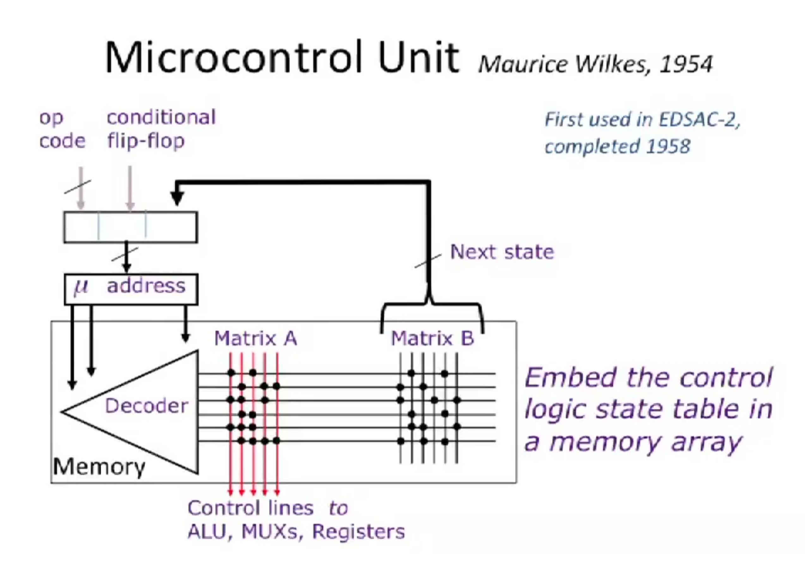
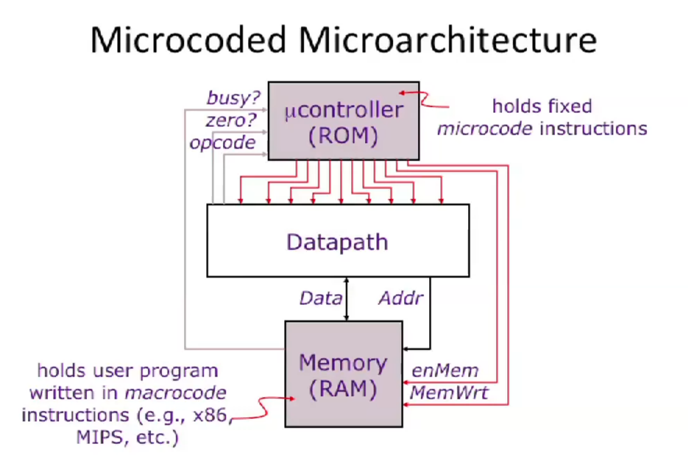
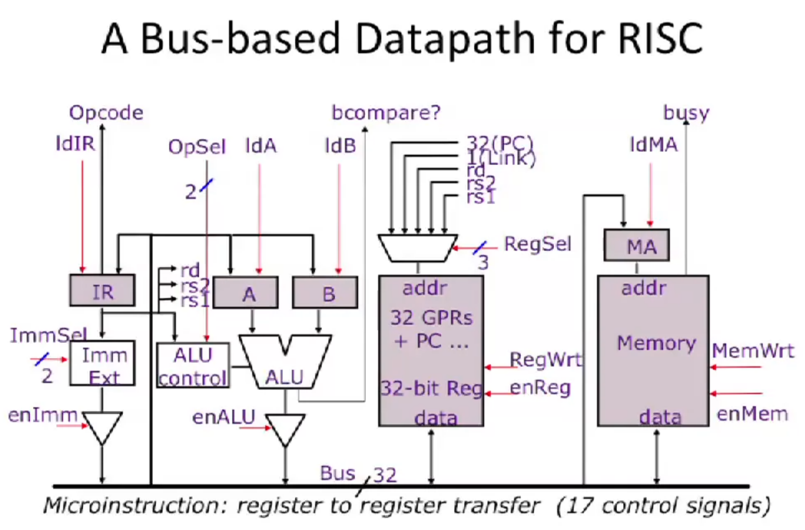

# Microcoded Microarchitecture

## Microcontrol Unit

Instead of using complex hardwired combinatorial logic to asset CPU control signals, a microprogrammed control unit embeds the state transitions directly inside a memory array.

- Every macro-instructire such as ADD is broken down to a sequence of simple micro-instructions.

- Each row in the memory matrix corresponds to one micro-instruction, storing the exact bit patterns needed to control the processor's hardware for that specific step.

### Core Concepts
* **Macro-instruction:** A standard assembly instruction written by a programmer (e.g., `ADD`, `LW`). Lives in RAM.
* **Micro-instruction:** Low-level configuration bits in ROM that execute a single sub-step of a macro-instruction by opening/closing hardware pathways.
* **Datapath:** The physical hardware (ALU, registers, buses) that manipulates data.
* **Control Unit / Microcontroller:** The component that decodes macro-opcodes and issues micro-instructions to the Datapath.

### Wilkes' Microcontrol Unit
* **Mu address:** A register holding the memory pointer for the microcode ROM.
* **Decoder:** Circuitry that translates the micro-address to activate one specific row in the control memory.
* **Matrix A:** The memory array that outputs control signals to the hardware for the current step.
* **Matrix B:** The memory array that determines the address of the next micro-instruction.
* **Conditional Flip-Flop:** Hardware flags (like Zero/Carry) used to handle conditional branching in microcode.

## Microcoded Microarchitecture

## A Bus-based Datapath for RISC

### Bus-Based Datapath Signals & Components
* **IR (Instruction Register):** Holds the fetched 32-bit macro-instruction.
* **Imm Ext (Immediate Extender):** Expands short immediate constants into full 32-bit values.
* **A & B:** Temporary registers that hold steady inputs for the ALU.
* **32 GPRs + PC:** General Purpose Registers and the Program Counter.
* **MA (Memory Address Register):** Holds the RAM address the CPU wants to access.
* **ldIR / ldA / ldB / ldMA:** Control signals telling these specific registers to capture data from the bus.
* **ImmSel / OpSel / RegSel:** Selection lines determining configuration for the immediate extender, ALU operation, or active register.
* **enImm / enALU / enReg / enMem:** Enable signals that allow a component to output its data onto the shared bus.
* **RegWrt / MemWrt:** Write enable signals for the register file or RAM.
* **bcompare?:** Status wire indicating if an ALU comparison condition is met.
* **busy:** Feedback signal from RAM telling the controller to stall while memory finishes an operation.
