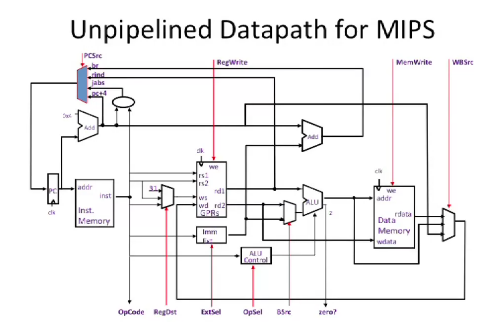
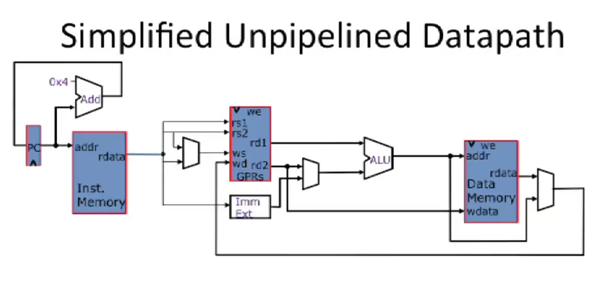
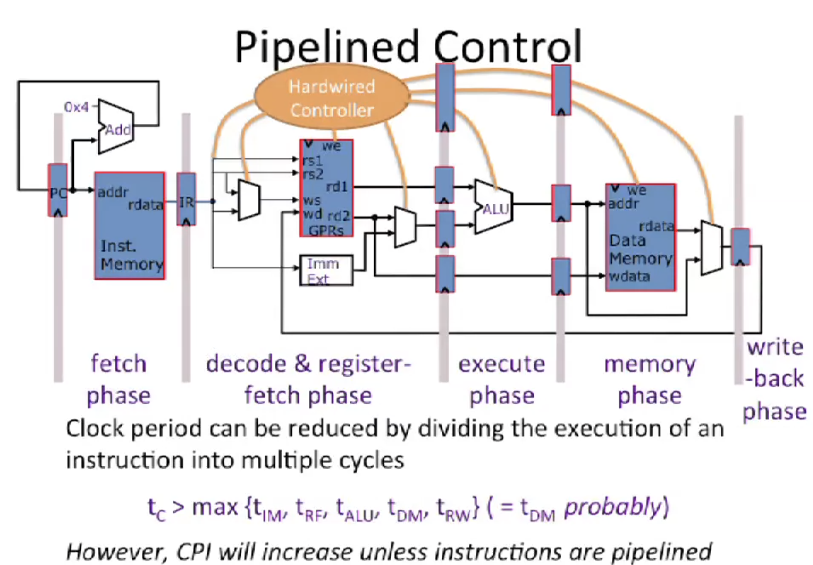
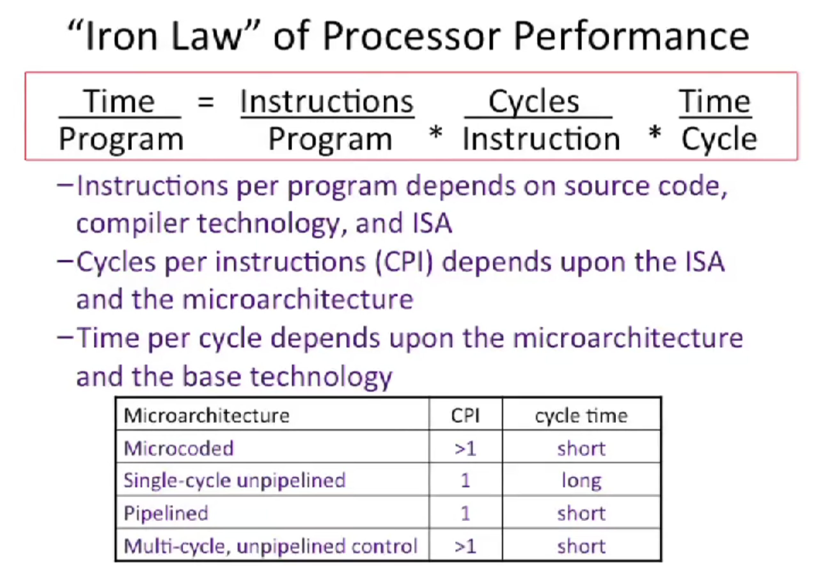
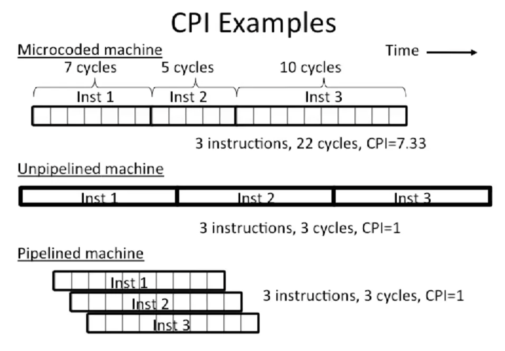

# Pipeline

## An Ideal Pipeline
- All objects go through the same stages
- No sharing of resources between any two stages
- Propagation delay through all pipeline stages is equal
- Schedling of a transaction entering the pipeline is not affected by the transactions in other stages

## Unpipelined Datapath for MIPS

## Simplied Unpipelined Datapath

## Pipelined Control

## Iron Law of Processor Performance

**Time/Program** = Instructions/Program * Cycles/Instruction * Time/Cycle

## CPI Examples
