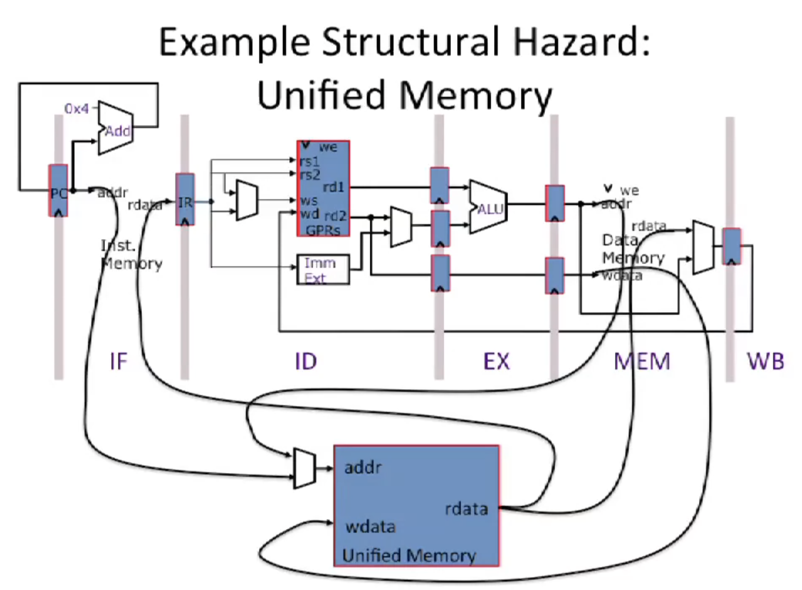

# Structural Hazard

## Overview of Structural Hazards

Structural hazards occur when two instructions need the same hardware resource at the same time.

Approaches to resolving structural hazards
- **Schedule:** Programmer explicitly avoids schedling instructions that would create structural hazards.
- **Stall:** Hardware includes control logic that stalls until earlier instruction is no longer using contended resource.
- **Duplicate:** Add more hardware to design that each instruction can access independant resources at the same time.

## Example Structural Hazard: Unified Memory
