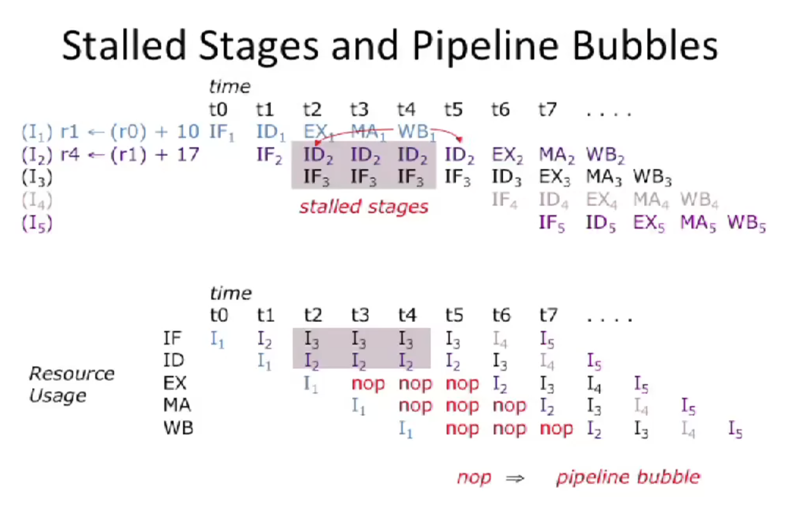

# Data Hazards

## Overview of Data Hazards

Data hazards occur when one instruction depends on the data value produced by a preceding instruction still in the pipeline.

Approaches to resolving data hazards
- **Schedule:** Programmer explicitly avoids scheduling instructions that would create data hazards.
- **Stall (Interlocking):** Hardware includes control logic that freezes earlier stages until preceding instruction has finished producing data values.
- **Bypass:** Hardware datapath allows values to be sent to an earlier stage before preceding instruction has left the pipeline
- **Spectulate:** Guess that there is not a problem, if incorrect kill speculative instruction and restart??

## Stalled Stages and Pipeline Bubbles
